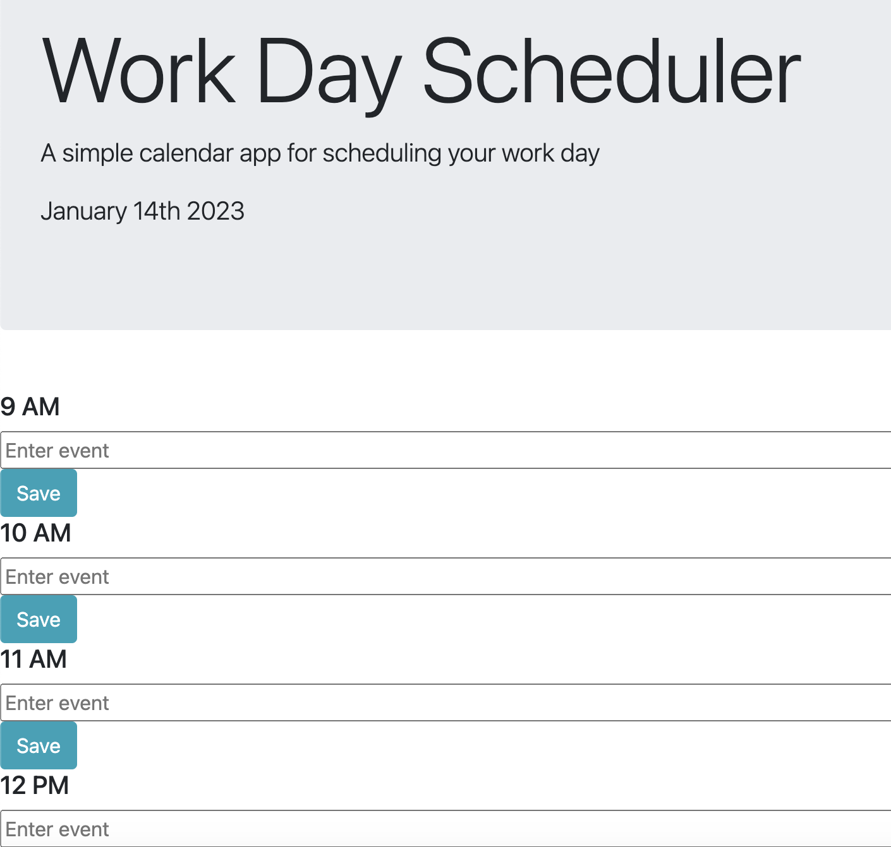

## Creating a Work-Day Scheduler

### Description

The work-day scheduler displays a daily work-hours calendar wherein a user can type in an event.
To use the work-day Scheduler, simply type the event in the timeslot space, which is a clear form space. The typed event is saved onto local storage.

### Visuals

### Link

Link to the completed webpage:
